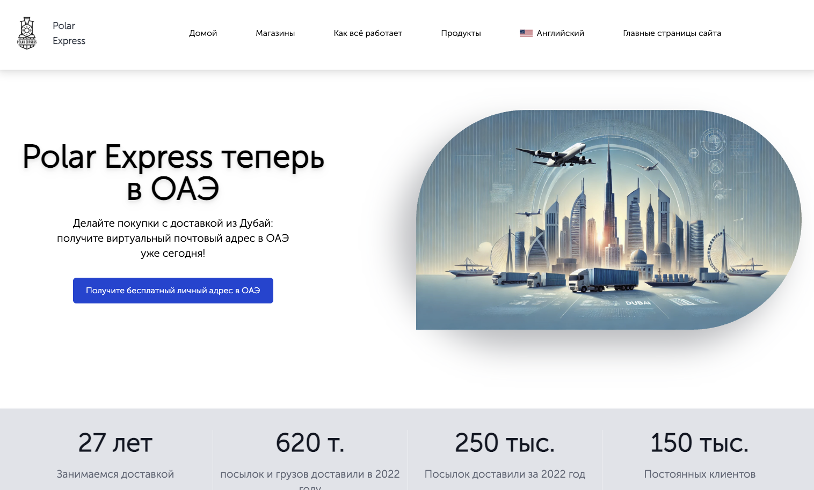

# v1 – Dubai Landing Page

A static, mobile-friendly landing page promoting **shopping with delivery from Dubai (UAE)**. Includes a hero with CTA, a Flickity-powered brand carousel, “How it works” walkthrough, and product highlight cards. Content is primarily in Russian.

## ✨ Features
- Hero section with background image + **CTA** to registration  
- **Stores carousel** (Flickity) linking to popular UAE retailers  
- “**Как всё работает**” step-by-step table with illustrations  
- Product categories grid (cards) with images and captions  
- Responsive layout via **Bootstrap 4**  
- Lazy external assets and minimal custom CSS/JS  

## 🧰 Tech Stack
- **HTML5** + **CSS**  
- **Bootstrap 4.1** (layout/components)  
- **Flickity 3.0** (carousel)  
- **jQuery 3.7** (DOM helpers)  
- Custom: `main.css`, `main.js`  
- Assets folder: `Dubai_Project/` (images, favicon)  

## 📁 Structure
```bash
.
├── index.html
├── main.css
├── main.js
└── Dubai_Project/
    ├── background.jpeg
    ├── logo.ico
    ├── company1.jpg … (store logos)
    ├── info1.png … info graphics
    ├── product images …
```

## 📦 Installation & Usage

1. Clone this repository:
   ```bash
   git clone git@github.com:DanilSidorov8625/PEX-Dubai-Landing-Page.git
   cd PEX-Dubai-Landing-Page
   ```
   
2.	Open index.html directly in your browser
   
3.	Customize content:
    - Update Dubai_Project/ with images
	  - Edit style.css for custom branding
	  -	Replace shop/product links as needed

## 📸 Preview



## 🙌 Credits
	- Creator - Danil Sidorov
	- For - PEX